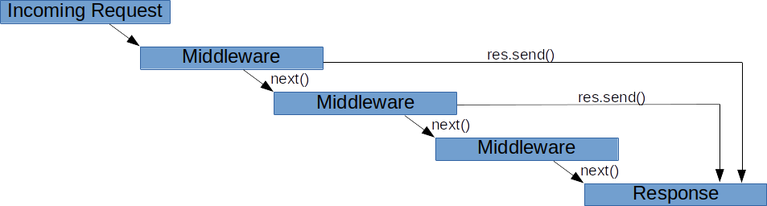
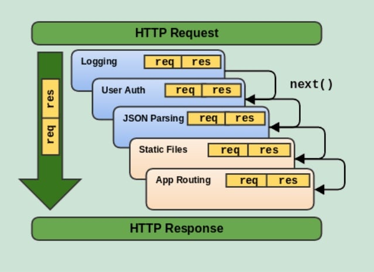

# Routes

Kullanıcı bir istek gönderir (GET, POST, PUT, vs)
         ⬇
Express sunucusu (router.js) bu isteği yakalar
         ⬇
`app.use(router)` ile routes/index.js'e yönlendirir
         ⬇
routes/index.js içindeki router.route("/") yakalar
         ⬇
Uygun HTTP metoduna göre (GET, POST, PUT) cevap döner

# Routes & Middlewares

### What? Why?

### Example:

