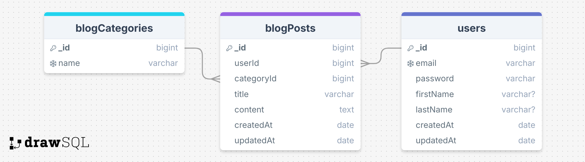

# BLOG Project with Mongoose

## MONGOOSE

https://mongoosejs.com/

## BLOG API

### ERD(Entity Relation Diagram)

DrawSql.com 'dan 



### Folder/File Structure:

```
    .env
    .gitignore
    index.js
    package.json
    readme.md
    src/
        dbConnection.js
        middlewares/
            errorHandler.js
        models/
            blogModel.js
        controllers/
            blogController.js
        routes/
            blogRouter.js
```

## Not 

nodemon için rs komutu(restart)


## MVC(Backendi yazdığımız standart)
* Table= Collections
* Taslak= Schema

* Kod yazarken sıramız: Model > Controller > Route

* Document oluşturursak database gözükecek, Mongodb de.